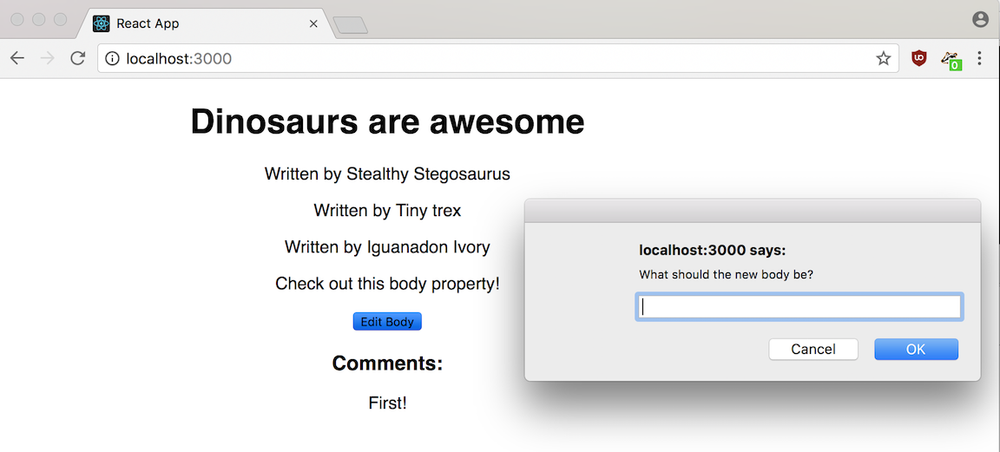
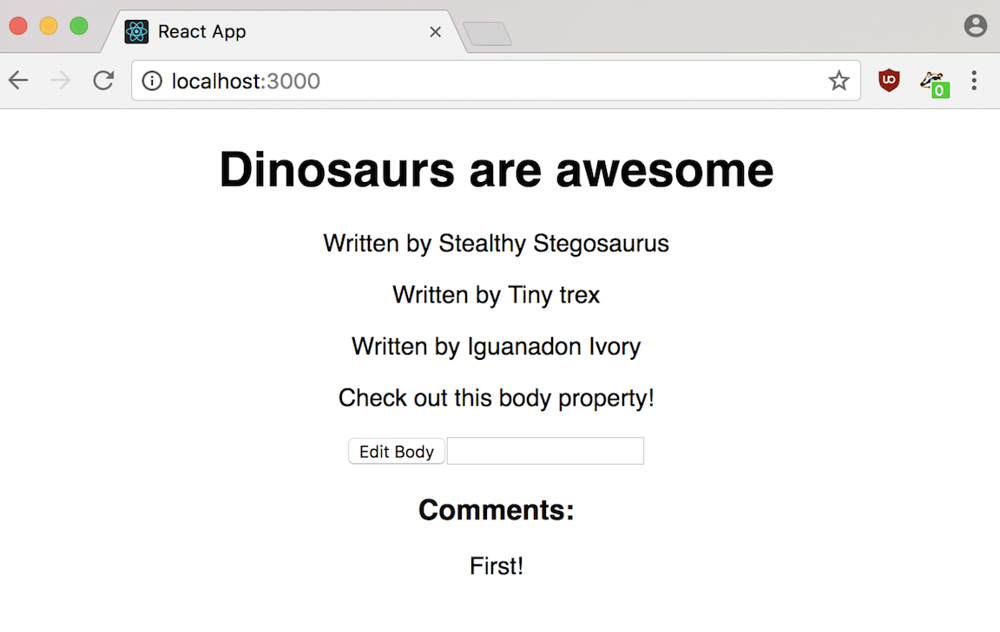

# You Do: Implement State (20 minutes) #

Let's implement state in our Blog by making `body` a mutable value.
> Remember to switch the running application!

**Note:** In React `state` just represents the state of data on our page.
Something saved to `state` in React is not automatically saved to a database,
or to local storage. `state` is just what's currently on the page. If you
refresh the page then all `state` is lost, and refreshed with the page.

1. Set an initial `state` inside a `constructor()` method for our `Post` component. The `state` attribute should be called `body`. Set the value of the `body` key to be the `body` prop that's passed into the component.
2. Modify `Post`'s `render` method so that it uses the `body` from `state`, not `props`.
3. Create a `changeBody` method inside `Post` that updates `body` based on a user's input.
  - You should use `setState` somewhere in this method.
  - How can you get user input? Keep it simple and start with `prompt`.
4. Add a button to `Post`'s `render` method that triggers `changeBody`.

## Solution

Your solution should look as follows:

### Bonus I ###

Use a form to take in user input.

- The blog post's body should be updated dynamically when the user types in an input field.
- One option is to keep track of what the new input is going to be by triggering a method using `onChange` on the `<input>`.
- Another option is to pass an event object to the `onSubmit` method and traverse the DOM from the event's target (for example, `e.target`) to find the `<input>` value.
- Note: You can leave the button from above to give the user options!

## Bonus Solution

Your solution should look as follows:

